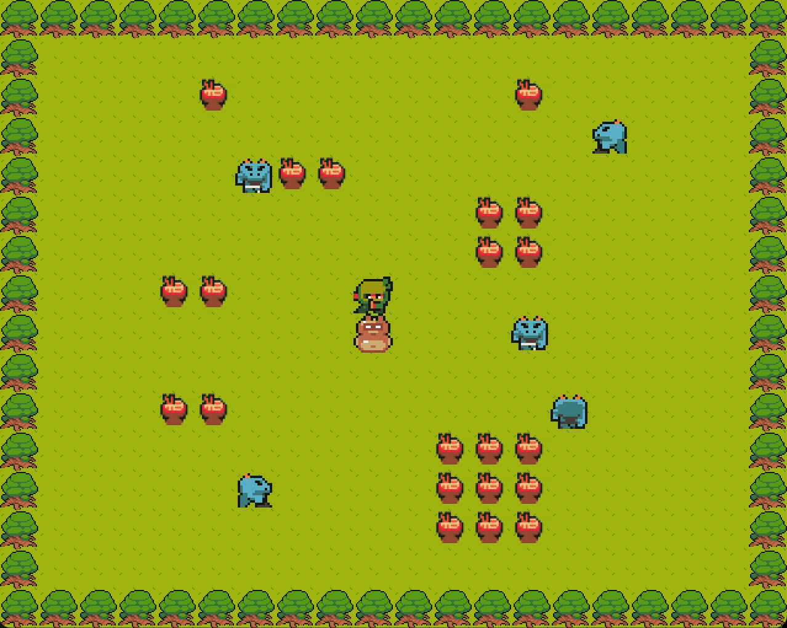

<div align="center">

# so_long

A simple 2D tile-based game —  
Help the ninja collect all the ramen,  
and turn his tanuki friend back to normal before the blue monsters catch you!


---

## 🛠️ Build

```bash
make        # builds the main version  
make bonus  # builds the bonus version
````

---

## ▶️ Run (Like this)

```bash
./so_long maps/map1.ber  
./so_long_bonus maps/map1.ber
```

---

## 🎮 Controls

WASD / Arrow keys — Move
ESC — Quit

---

## 📸 Screenshots

<p align="center">
  
  
</p>

<p align="center">
  
</p>

## Enjoy!

<p align="center">
  
</p>

## Thanks :)


</div>

