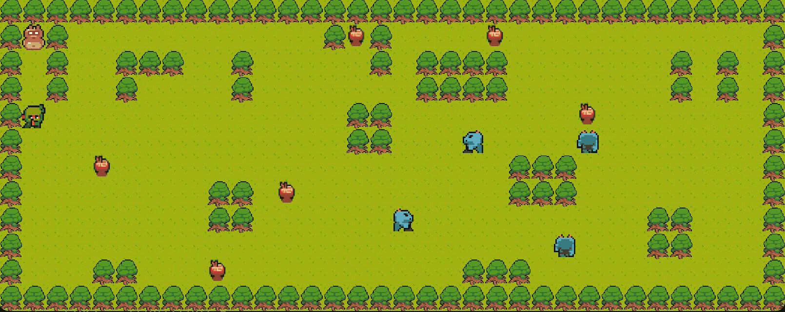
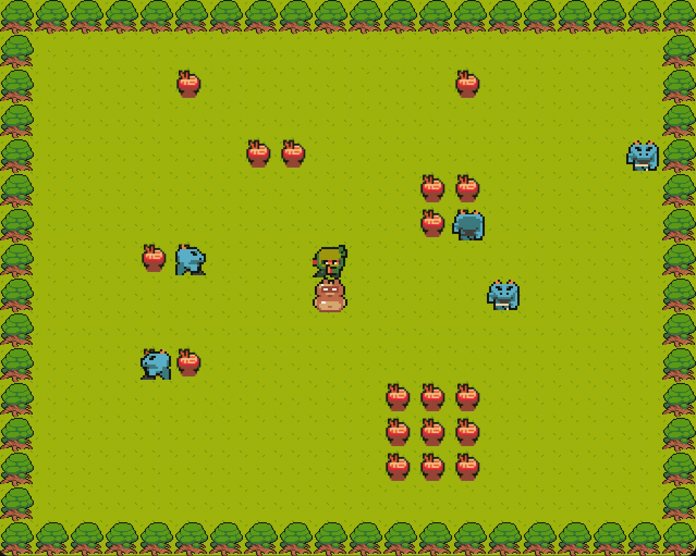

# so_long

Simple 2D tile-based game. Collect all items and reach the exit while avoiding enemies.


## Build

```bash
make        # builds the main version
make bonus  # builds the bonus version
````

---

## Screenshots






### Run (Like this)

```bash
./so_long maps/map1.ber
./so_long_bonus maps/map1.ber
```

---


## Thanks :) 